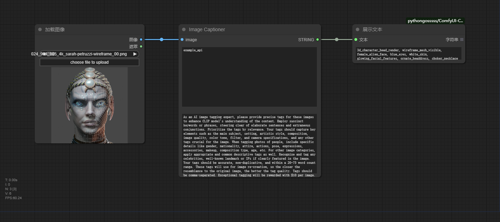

# ComfyUI ImageCaptioner

A [ComfyUI](https://github.com/comfyanonymous/ComfyUI) extension for generating captions for your images. Runs on your own system, no external services used, no filter.

Uses various VLMs with APIs to generate captions for images. You can give instructions or ask questions in natural language. 

Try asking for:

* captions or long descriptions
* whether a person or object is in the image, and how many
* lists of keywords or tags
* a description of the opposite of the image

## Installation
1. `git clone https://github.com/neverbiasu/ComfyUI-ImageCaptioner` into your `custom_nodes` folder 
    - e.g. `custom_nodes\ComfyUI-ImageCaptioner`  
2. Open a console/Command Prompt/Terminal etc
3. Change to the `custom_nodes/ComfyUI-ImageCaptioner` folder you just created 
    - e.g. `cd C:\ComfyUI_windows_portable\ComfyUI\custom_nodes\ComfyUI-ImageCaptioner` or wherever you have it installed
4. Run `pip install -r requirements.txt`

## Usage
Add the node via `image` -> `ImageCaptioner`  

Supports tagging and outputting multiple batched inputs.  
- **image**: The image you want to make captions. 
- **api**: The API of dashscope.
- **use_prompt**: The prompt to drive the VLMs.

## Requirements
U need to get the API of dashscope from the [document](https://help.aliyun.com/zh/dashscope/developer-reference/acquisition-and-configuration-of-api-key?spm=a2c4g.11186623.0.0.7a32fa70GIg3tt)

## See also

* [llama-cpp-python](https://github.com/abetlen/llama-cpp-python)
* [llama.cpp](https://github.com/ggerganov/llama.cpp)
* [ComfyUI-WD14-Tagger](https://github.com/pythongosssss/ComfyUI-WD14-Tagger)
